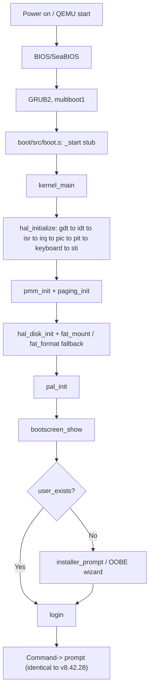
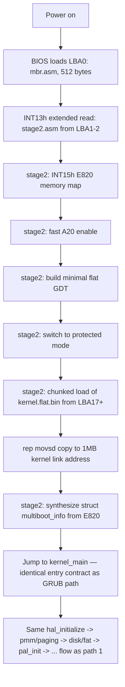
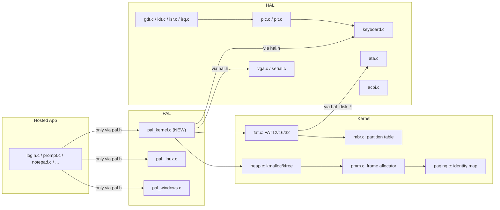
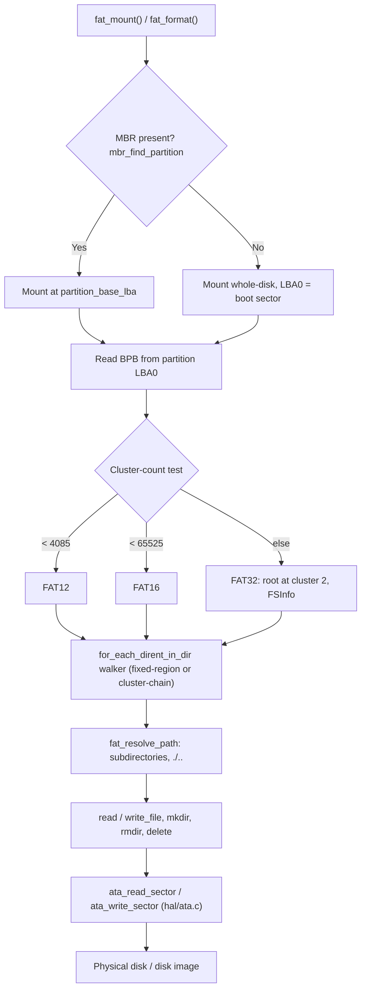
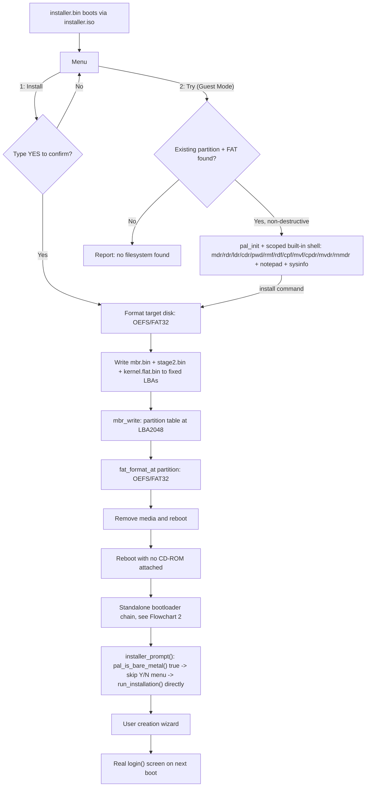
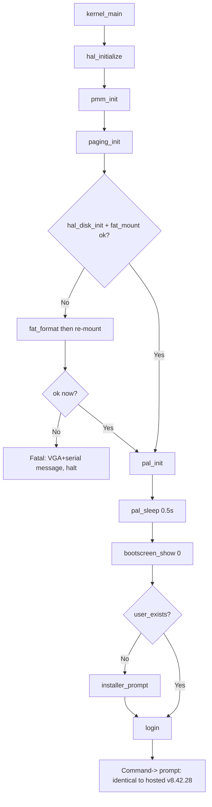

# 🚀 OE_REBOOT – Operating Environment Reboot (v10.22.37)

<div align="center">


**OE stops being "just a console program" and becomes an operating system.**
Same PAL, same UI, same login/shell/apps you know from v8.42.28 — now booting natively on real x86 hardware, with its own kernel, HAL, bootloader, FAT12/16/32 filesystem, MBR partitioning, and a disk installer.

*This document covers the entire bare-metal kernel generation built on top of v8.42.28: `[README (1).md]` (v8.42.28), `[README (2).md]` (v6.12.56), `[README (3).md]` (v6.48.21), `[README (4).md]` (v8.13.07), `[README_1.md]` and `[README (5).md]` (the two prior full/merged canonical histories). Nothing from those is repeated in depth here except what is needed for continuity — read them for the pre-kernel story; read this one for everything that happened between v8.42.28 and v10.22.37.*

</div>

---

## 📖 Table of Contents

- [Overview](#-overview)
- [What's New in v10.22.37](#-whats-new-in-v102237)
- [Evolution: v8.42.28 → v10.22.37](#-evolution-v84228--v102237)
- [Architecture at a Glance](#️-architecture-at-a-glance)
- [Flowcharts](#-flowcharts)
- [Phase-by-Phase Kernel Development Log](#-phase-by-phase-kernel-development-log)
- [Feature Comparison (All Releases)](#-feature-comparison-all-releases)
- [System Modules](#-system-modules)
- [File Structure](#-file-structure)
- [Building from Source](#-building-from-source)
- [First-Time Usage](#-first-time-usage)
- [Known Issues / Open Items](#-known-issues--open-items)
- [Roadmap / Future Plans](#️-roadmap--future-plans)
- [Version History](#-version-history)
- [Contributing](#-contributing)
- [Contact](#-contact)

---

## 🔍 Overview

**OE_REBOOT v10.22.37** is the point where the long-stated "future roadmap" line that every prior README carried under *Kernel/PAL groundwork* — *"Adding kernel, Building bootloader, HAL (arm, arm64, x86, x64)"* — stopped being a roadmap item and became real, working, booting code.

Everything documented in `README (1).md` through `README (5).md` (the full hosted OE_REBOOT app: login, user management, installer, registry editor, settings, notepad, calculator, systeminfo, PAL for Windows/Linux) is **unchanged in behavior** in v10.22.37. What's new is a **third PAL backend** (`pal_kernel.c`) that satisfies the exact same `pal.h` contract as `pal_windows.c`/`pal_linux.c`, sitting on top of a from-scratch:

- 32-bit protected-mode kernel (monolithic, ring-0-only, single-tasking — no scheduler/ring3 yet, by deliberate design, matching the MS-DOS precedent for what "counts" as an OS at v1)
- Hardware Abstraction Layer (`hal/`) for VGA, serial, GDT/IDT/ISR/IRQ, PIC, PIT, PS/2 keyboard, ATA disk, ACPI power-off
- Physical memory manager + identity-mapped paging
- A real FAT12/16/32 filesystem implementation (read **and** write) with MBR partitioning
- A standalone two-stage x86 bootloader (no GRUB dependency at runtime)
- A live-CD-style disk installer with an Install/Try(Guest) menu

The result: the same login screen, the same `Command->` shell, the same apps a v8.42.28 user already knows — now running with **zero host operating system underneath**, verified booting in QEMU, and installable to a real disk image that boots on its own via a custom bootloader.

Core design goals (carried through every release, [[project_oe_reboot_overview]]):

- Small, portable C codebase (C99)
- Clear subsystem boundaries (PAL, UI, system tools — now also kernel/HAL)
- Simple installer/registry for modular apps
- Console-first UI with a structured, table-driven command shell
- **New in v10.x**: "only `pal_*` touches libc" extended to "only `hal/src`'s C files touch hardware" — the same discipline, one layer lower

---

## ✨ What's New in v10.22.37

Build metadata (see `system_core/include/branding.h`):

- Version: **v10.22.37**
- Build type: `(Pre Release Build C and PAL Based)`
- Developer: Subhajit Halder
- Build date/time: **02/09/2026, 2:47 am**

Highlights since the last documented snapshot (v8.42.28, 26/08/2026):

- 🧠 **A real kernel** — GRUB2/multiboot1-booted x86 protected-mode kernel with its own GDT/IDT, exception handlers, IRQ dispatch, PIT timer, and PS/2 keyboard driver.
- 🧱 **A real HAL boundary** — every hardware-touching driver lives in `hal/`; `kernel/` only ever includes `hal.h`.
- 💾 **A real filesystem** — FAT12/16/32 read+write, subdirectories, MBR partition-aware, formats a genuinely blank disk from scratch (`fat_format()`), independently verifiable with `mtools`.
- 🔌 **A third PAL backend** — `pal_kernel.c` fully implements `pal.h` (console, file, math, string, dir/file commands, `pal_oe_info`) as plain function calls (no trap-based syscalls yet — deliberate, since v1 stays ring-0-only).
- 🥾 **A standalone bootloader** — two-stage real-mode → protected-mode x86 bootloader that boots the kernel with **no GRUB, no CD-ROM, no host OS** — just a raw disk.
- 💿 **A disk installer** — live-CD style Install/Try menu, writes the full boot chain + a fresh OEFS/FAT32 partition to a target disk, verified to produce a disk that boots the real OS end to end on its own.
- 🐛 **Real, previously-latent bugs found and fixed** only once real hardware paths were exercised for the first time: an ANSI→VGA color-palette mapping bug, a VGA line-wrap double-advance bug, a keyboard raw/cooked queue cross-contamination bug (notepad "garbage first line"), an out-of-range ACPI table dereference causing a shutdown page-fault on non-QEMU hypervisors, and a missing explicit VGA cursor-shape program (cursor rendering wrong on VMware).
- 📄 **Full project-standard file headers** added across the entire `kernel/`, `hal/`, `pal_kernel.c`, `installer/`, `boot/`, `bootloader/` tree (~43 files) — the same Author/Date/Module/About/Revisions convention the hosted app already used everywhere.

---

## 🔄 Evolution: v8.42.28 → v10.22.37

| Aspect | v8.42.28 (hosted only) | v10.22.37 (bare-metal generation) |
|---|---|---|
| **Where it runs** | Windows or Linux process, via host OS | Real/emulated x86 hardware, no host OS — plus still Windows/Linux via the original PAL backends |
| **PAL backends** | `pal_windows.c`, `pal_linux.c` | Same two, **plus `pal_kernel.c`** (was a 0-byte stub) |
| **Boot process** | OS process launch → `main()` | GRUB2/multiboot1 **or** a custom 2-stage bootloader → `kernel_main()` → hosted `main()`-equivalent flow |
| **Memory management** | Host OS heap (`malloc`/`free` via libc, wrapped by PAL) | Bitmap physical frame allocator + identity-mapped paging + a from-scratch `kmalloc`/`kfree` heap |
| **Filesystem** | Host filesystem (NTFS/ext4/etc.) via PAL wrappers | Own FAT12/16/32 implementation (`kernel/fat.c`) over a real ATA PIO disk driver, MBR-partition-aware |
| **Interrupts/input** | Host OS handles hardware; PAL just calls libc console I/O | Own IDT/ISR/IRQ, PIC remap, PS/2 keyboard driver with cooked+raw queues |
| **Installability** | "Install" = create a user account inside an existing OS | "Install" = **write a bootable OS to a disk** (bootloader + kernel + partition table + filesystem), live-CD style |
| **Hosted app behavior** | Baseline | **Unchanged** — same login, shell, apps, all 30+ hosted-app source files reused as-is, zero rewrites needed |
| **Password hashing, backdoors, security posture** | As documented in the security audit ([[project_oe_reboot_status]]) | **Identical** — the audit's open items (Linux PAL injection guard gap, plaintext-debug-print residue, etc.) are unaffected by the kernel work and still open |

---

## 🏗️ Architecture at a Glance

The v6.x/v8.x layering (PAL → UI → shells → user management → app installer) is **entirely preserved**. What's new is everything *underneath* the PAL box:

```
┌───────────────────────────────────────────────────────────┐
│                      Hosted OE App                         │
│  main.c / prompt.c / login.c / installer.c / settings.c /  │
│  regedit.c / notepad / calculator / systeminfo / ...        │  ← UNCHANGED since v8.42.28
└───────────────────────────────────────────────────────────┘
                              │
                              ▼
┌───────────────────────────────────────────────────────────┐
│           Platform Abstraction Layer (PAL) — pal.h          │
│   pal_windows.c   │   pal_linux.c   │   pal_kernel.c (NEW)   │
└───────────────────────────────────────────────────────────┘
        │                    │                    │
        ▼                    ▼                    ▼
   Windows APIs          Linux/libc          ┌─────────────────────┐
                                              │   kernel/  (NEW)     │
                                              │  heap, pmm, paging,  │
                                              │  fat.c, mbr.c        │
                                              └─────────────────────┘
                                                        │
                                                        ▼
                                              ┌─────────────────────┐
                                              │    hal/    (NEW)     │
                                              │  vga, serial, gdt,   │
                                              │  idt, isr, irq, pic, │
                                              │  pit, keyboard, ata, │
                                              │  acpi                │
                                              └─────────────────────┘
                                                        │
                                                        ▼
                                              ┌─────────────────────┐
                                              │  boot/ + bootloader/ │
                                              │  (NEW) GRUB multi-   │
                                              │  boot1 header, OR a  │
                                              │  standalone 2-stage  │
                                              │  real→protected mode │
                                              │  x86 bootloader       │
                                              └─────────────────────┘
                                                        │
                                                        ▼
                                                  Real x86 CPU
```

---

## 🔀 Flowcharts

### 1. Full Bare-Metal Boot Chain (GRUB path, Phase 1)



### 2. Standalone Bootloader Chain (no GRUB, no CD-ROM — Stage 4)



### 3. HAL / Kernel / PAL Layering (who is allowed to touch what)



### 4. Disk / Filesystem Stack (FAT12/16/32 + MBR)



### 5. Disk Installer — Install vs Try Mode (2026-09-01 feature)



### 6. `kernel_main` Real Sequencing (Phase 7 onward)



---

## 🧭 Phase-by-Phase Kernel Development Log

Everything below happened on **2026-08-30 through 2026-09-01**, entirely from scratch — `kernel/`, `hal/`, and `boot/` were empty directories with no files at the start of Phase 1, and `pal/src/pal_kernel.c` was a 0-byte stub.

### Phase 1 — Boot to "Hello Kernel" ✅
GRUB2/multiboot1 boot via `boot/src/boot.s`, `kernel/src/kernel.c`, linked at 1MB (`kernel/linker.ld`). VGA text driver (`vga.c`) and a COM1 serial driver (`serial.c`) added specifically so success is verifiable headlessly. Verified via `qemu-system-i386 -cdrom os.iso -display none -serial stdio` printing "OE Reboot kernel alive."

**Extended same day**: `vga.c` grew into a full CSI/ANSI escape interpreter (SGR colors incl. bright ranges, CUP, ED, relative cursor moves, DECTCEM cursor hide/show, DECAWM auto-wrap toggle, hardware cursor via CRTC ports, blink-disable) — because the hosted app's UI prints raw ANSI expecting a terminal underneath, and bare metal has none.

### Phase 2 — Interrupts, PIC, PIT, Keyboard ✅
Own flat GDT (`gdt.c`), 256-entry IDT (`idt.c`), 32 CPU exception handlers via GCC's `__attribute__((interrupt))` (`isr.c` — no hand-rolled asm stubs), 16 IRQ stubs + PIC remap (`irq.c`/`pic.c`), PIT tick counter (`pit.c`), PS/2 keyboard driver with shift-state tracking (`keyboard.c`). Needed `-mgeneral-regs-only` in `CFLAGS` (interrupt-attribute functions can't touch the FPU). Verified via QEMU monitor `sendkey` injection round-tripping through serial.

### Phase 3 — Physical Memory + Paging ✅
Multiboot mmap parsing (`multiboot.h`), bitmap physical frame allocator (`pmm.c`), identity-mapped paging capped at 256MB (`paging.c`). All address math uses shifts, never `/`/`%` on 64-bit values (no `__udivdi3` under `-nostdlib`). Verified at 128MB and 512MB RAM, plus a keyboard-IRQ regression check.

### Phase 4 — HAL Boundary ✅
Every hardware-touching driver moved (not rewritten) from `kernel/` to `hal/`. New `hal/include/hal.h` is the real contract (`hal_initialize`, `hal_console_print`, `hal_debug_print`, `hal_timer_get_ticks`). `kernel.c` now only includes `hal.h` — mirrors the PAL's own "only pal_* touches libc" rule one layer down.

### Phase 5 — Disk + FAT12/16 ✅
Primary-bus ATA PIO driver (`hal/ata.c`, wall-clock timeout via PIT, not a spin count). FAT12/16 parser (`kernel/fat.c`) determining FAT12 vs FAT16 by Microsoft's own cluster-count test, not by the label string. `mtools` used to seed a real 16MB `disk.img`. Verified: kernel enumerates the real root dir and reads real file content off emulated disk.

### Phase 6 — `pal_kernel.c` (third PAL backend) ✅
First real implementation of the PAL contract for bare metal: `heap.c` (kmalloc/krealloc/kfree, first-fit free-list over a static 1MB arena), cooked+raw keyboard input queues, `pal_file_open_read` backed by real FAT reads. Scope line explicitly deferred (not stubbed silently): `pal_math.h`, `pal_oe_info.h`, `pal_dir_file_cmds.h`, file writes — all closed out in Phase 7. Verified live via injected keystrokes + `screendump`.

### Phase 7 — FULL PORT ✅ (the biggest single phase)
The **entire hosted OE_REBOOT app now boots and runs natively**, chosen deliberately over a scoped auth-only slice. In order:
1. **FAT write support** — `fat_write_file`/`fat_delete_file`, writes to every FAT copy, `ata_write_sector` with a cache-flush-before-return guarantee.
2. **`pal_kernel.c` completed** — full `pal_math.h` (hand-rolled `atof`/`ftoa`, a from-scratch Taylor-series `pal_pow` for real exponents with an exact fast path for whole numbers), full `pal_oe_info.h` (CPUID brand string), full `pal_dir_file_cmds.h` (root-only at this point — `mdr`/`rdr`/`cpdr` etc. fail closed until Stage 2 below added subdirectories).
3. **`kernel/heap.c`** backing every `pal_alloc` call transitively.
4. **30 hosted app files wired in as-is** — `app_installer`, `system_core`, `system_tools/*`, `user_management/*`, `utilities/*`, and more — **zero fixes needed to the app logic itself**, confirming the PAL-only-touches-libc convention held throughout the project's history.
5. **Two toolchain fixes found via the linker**: linking `libgcc.a` for real 64-bit division (`systeminfo.c`), and a `FPU_OBJS` Makefile list stripping `-mgeneral-regs-only` for the handful of files doing genuine double-precision math.
6. **Two real, previously-latent `vga.c` bugs**, only exposed once real ANSI-colored UI exercised the driver: an ANSI-to-VGA color palette mapping bug (blue rendered as red — different hardware palette order) and a missing deferred/lazy line-wrap (writing exactly column 80 then an explicit `\n` double-advanced the row, corrupting every other row's background).
7. **`kernel_main` now runs the real flow**, matching the hosted `main.c` line for line.

Verified end-to-end via QEMU monitor `sendkey` + `screendump`: bootscreen → installer wizard → user creation ("admin"/"secret") → "Improvements in Version 8.42.28" screen — the literal same app, running bare metal.

### FAT32 + MBR + Subdirectories + Bootloader + Installer (2026-08-31, 6 stages) ✅
1. **FAT32** — `fat.c` rewritten with a generalized `struct fat_dir` (fixed-region vs cluster-chain), FAT32 4-byte entries, `fat_format()`'s FAT32 path (fatgen103 table, FSInfo, root at cluster 2). Both FAT16 and FAT32 brand OEM/volume label as **"OEFS"** — standard, byte-for-byte `mtools`-readable, not a from-scratch format.
2. **Subdirectories** — path-aware API (`fat_resolve_path`, `fat_mkdir_in`, `fat_rmdir_in`, `_in`-suffixed read/write/delete) built on the cluster-chain walker; real `.`/`..` dirents; `pal_kernel.c` gained real `mdr`/`rdr`/`cdr`/`pwd`/`ldr`/`cpf`/`mvf`/`rnmf`/`rmf`/`rdf`.
3. **MBR** — `mbr.c` (`mbr_find_partition`, `mbr_write`), `fat_mount_at`/`fat_format_at` taking a `partition_base_lba`. `kernel_main` tries MBR first, falls back to whole-disk.
4. **Standalone bootloader** (highest-risk stage, succeeded) — `bootloader/src/mbr.asm` + `stage2.asm`: real-mode → E820 → A20 → flat GDT → protected mode → chunked kernel load → synthesized `multiboot_info` — same handoff contract as GRUB, zero `kernel_main` changes needed. Verified booting **with no `-cdrom` at all**.
5. **Isolated disk installer** — `installer/src/installer_main.c`, a genuinely separate minimal kernel entry point, embeds `mbr.bin`/`stage2.bin`/`kernel.flat.bin` at build time (`gen_installer_assets.py`), writes them + a fresh partition + OEFS/FAT32 filesystem to a target disk.
6. **Full acceptance chain verified live**: installer.iso installs to a scratch disk → CD-ROM detached entirely → reboot on disk alone → standalone bootloader → real OOBE wizard → user created → reboot again → lands on the real `login()` screen. The literal "USB/CD installer writes a bootable system to HDD" flow, working end to end.

**Deferred by explicit user request**: non-destructive install alongside existing partitions (dual-boot style) — an advanced feature, intentionally left for a future update.

### Gap-closure pass (2026-08-31) ✅
- `cpdr`/`mvdr`/`rnmdr` wired into the interactive shell's command table + a new help page.
- Installer shows the **real disk model string** (IDENTIFY words 27-46, byte-swap-corrected).

### Live-CD Install/Try menu (2026-09-01) ✅
`installer_main.c` gained `[1] Install` / `[2] Try (Guest Mode)`. Try Mode non-destructively mounts an existing filesystem and drops into a scoped built-in shell (file/dir commands + notepad + sysinfo + install/reboot/exit) without ever touching the disk destructively unless `install` is explicitly run.

### Follow-up fixes (2026-09-01, two rounds) ✅
1. Redundant OOBE Y/N wizard after a fresh disk-install — `installer_prompt()` now checks `pal_is_bare_metal()` and skips straight to user creation on bare metal.
2. Try Mode's `sysinfo` now calls the real `oe_systeminfo_entry()` (same 3-page bordered screen as the hosted OS) instead of a reimplementation; `pmm_init()` now actually called so RAM stats are real, not zero-initialized.
3. Try Mode's shell UI rewritten to match the real `prompt()`'s bordered, redrawn-every-command look exactly.
4. **Notepad "garbage first line" bug found and fixed** — root cause: the keyboard IRQ handler pushed every keystroke into *both* the cooked and raw input queues unconditionally, so characters typed at the shell prompt that launched notepad leaked into notepad's raw-mode queue. Fixed with `keyboard_flush_raw()`/`keyboard_flush_cooked()` called on cooked/raw mode transitions.
5. **`shutdown` page-fault crash fixed** — `acpi.c` dereferenced ACPI table pointers assuming they always live below the 256MB paging identity-map cap; false on real firmware (SeaBIOS commonly places them near the top of RAM). Added `acpi_addr_safe()` gating every dereference; out-of-range now fails closed to the existing safe `hlt` fallback instead of crashing. Reproduced the failure condition in QEMU with `-m 512` and confirmed the fix; **VMware/VirtualBox retest still pending** (see Known Issues).
6. **VGA cursor shape bug** — `vga_set_cursor_visible()` never explicitly programmed the cursor *shape* (CRTC 0x0A/0x0B), inheriting whatever the platform BIOS left there. QEMU's default happens to be sane; VMware's apparently wasn't (user-reported "cursor blinking at top"). Fixed with an explicit `vga_set_cursor_shape(13, 14)`; **VMware retest still pending**.

### Full project-standard file headers (2026-09-01) ✅
The Author/Date Created/Date Last Modified/Module/File/About/Revisions header block (already standard across the hosted app) added to the entire `kernel/`, `hal/`, `pal_kernel.c`, `installer/`, `boot/`, `bootloader/` tree — ~43 files, dates reconstructed from this development history since there is still no git repository ([[project_oe_reboot_overview]]).

---

## 📊 Feature Comparison (All Releases)

| Feature | v6.12.56 | v6.48.21 | v8.13.07 | v8.42.28 | **v10.22.37** |
|---|:---:|:---:|:---:|:---:|:---:|
| Cross-platform (Windows/Linux, hosted) | ✅ | ✅ | ✅ | ✅ | ✅ |
| Salted SHA-256 password hashing | ❌ | ❌ | ⚠️ basic | ✅ | ✅ |
| Filesystem commands | ❌ | ❌ | ✅ | ✅ | ✅ (+ subdirectories) |
| Notepad / Calculator / SystemInfo | ❌ | ❌ | ✅ | ✅ | ✅ (unchanged) |
| **Boots on bare-metal x86 (no host OS)** | ❌ | ❌ | ❌ | ❌ | ✅ |
| **Own kernel (GDT/IDT/IRQ/PIC/PIT)** | ❌ | ❌ | ❌ | ❌ | ✅ |
| **Physical memory manager + paging** | ❌ | ❌ | ❌ | ❌ | ✅ |
| **Own FAT12/16/32 filesystem (R/W)** | ❌ | ❌ | ❌ | ❌ | ✅ |
| **MBR partitioning** | ❌ | ❌ | ❌ | ❌ | ✅ |
| **Standalone bootloader (no GRUB)** | ❌ | ❌ | ❌ | ❌ | ✅ |
| **Disk installer (writes bootable OS to HDD)** | ❌ | ❌ | ❌ | ❌ | ✅ |
| **Live-CD Install/Try menu** | ❌ | ❌ | ❌ | ❌ | ✅ |
| `pal_kernel.c` PAL backend | ❌ (0-byte stub) | ❌ (0-byte stub) | ❌ (0-byte stub) | ❌ (0-byte stub) | ✅ full implementation |
| Kernel-level hardening pass (Phase 8) | – | – | – | – | ⚠️ open (see Roadmap) |

---

## 🧱 System Modules

All modules from v8.42.28 ([[project_oe_reboot_overview]]) are unchanged. New in v10.22.37:

| Module | Role |
|---|---|
| `boot/` | Multiboot1 header + `_start` stub for the GRUB boot path |
| `bootloader/` | Standalone 2-stage real-mode → protected-mode x86 bootloader (`mbr.asm`, `stage2.asm`) — no GRUB dependency |
| `hal/` | Every hardware-touching driver: VGA, serial, GDT, IDT, ISR, IRQ, PIC, PIT, PS/2 keyboard, ATA disk, ACPI power-off |
| `kernel/` | `kernel_main`, physical memory manager, paging, heap allocator, FAT12/16/32, MBR partition parsing/writing |
| `installer/` | Standalone disk-installer kernel entry point — writes the boot chain + a fresh filesystem to a target disk |
| `pal/src/pal_kernel.c` | Third PAL backend — the same `pal.h` contract as `pal_windows.c`/`pal_linux.c`, implemented as plain calls into `hal/`+`kernel/` |

---

## 📁 File Structure

```
OE_REBOOT/
│   main.c
│   Makefile
│   OE_Reboot.vmx                  # VMware VM definition (IDE-attached disk.vmdk + os.iso)
│
├───boot                            # NEW — GRUB multiboot1 path
│   │   grub.cfg
│   └───src
│           boot.s
│
├───bootloader                      # NEW — standalone boot chain
│   ├───src
│   │       mbr.asm                 # 512-byte real-mode boot sector
│   │       stage2.asm              # E820, A20, GDT, protected-mode switch, kernel load
│   └───tools
│           write_mbr_partition.py
│
├───hal                             # NEW — every hardware-touching driver
│   ├───include
│   │       hal.h                   # the real contract kernel/ is allowed to call
│   │       io_ports.h
│   │       vga.h  serial.h  gdt.h  idt.h  isr.h  irq.h  pic.h  pit.h  keyboard.h  ata.h  acpi.h
│   └───src
│           vga.c  serial.c  gdt.c  idt.c  isr.c  irq.c  pic.c  pit.c  keyboard.c  ata.c  acpi.c  hal.c
│
├───kernel                          # NEW — kernel proper
│   │   linker.ld
│   ├───include
│   │       multiboot.h  pmm.h  paging.h  heap.h  fat.h  mbr.h
│   └───src
│           kernel.c  pmm.c  paging.c  heap.c  fat.c  mbr.c
│
├───installer                       # NEW — standalone disk installer
│   ├───include
│   │       installer_assets.h      # machine-generated, do not edit by hand
│   ├───src
│   │       installer_main.c
│   └───tools
│           gen_installer_assets.py
│
├───pal
│   ├───include
│   │       pal.h  pal_dir_file_cmds.h
│   └───src
│           pal_kernel.c            # v10.x — FULL implementation (was a 0-byte stub through v8.42.28)
│           pal_linux.c
│           pal_windows.c
│           pal_dir_file_cmds_linux.c
│           pal_dir_file_cmds_windows.c
│
├─── ... (app_installer, extras_and_info, file, help_docs, setup, system_core,
│         system_tools/{regedit,settings,notepad,calculator,systeminfo}, ui,
│         ui_strings, user_management, utilities — ALL UNCHANGED since v8.42.28,
│         see README (1).md / README (5).md for their full layout)
│
└───OE REBOOT V1                    # Visual Studio project wrapper (.vcxproj), not the real source root
```

> Root also carries build artifacts not part of source: `os.iso`, `disk.img`, `bootdisk.img`, `kernel.bin`, `kernel.flat.bin`, `mbr.bin`, `stage2.bin`, `installer.bin`, `installer.iso` — all regenerated by `make`.

---

## 🔧 Building from Source

### Prerequisites (bare-metal targets)
- WSL2 or a Linux environment with: `gcc`, `gcc-multilib`, `nasm`, `make`, `grub-pc-bin`, `grub-common`, `xorriso`, `mtools`, `qemu-system-x86`
- No real `i686-elf` cross-compiler is required — host `gcc -m32 -ffreestanding -fno-builtin -fno-stack-protector -fno-pie -mgeneral-regs-only` targets 32-bit correctly.

### Make targets

| Target | Produces | Notes |
|---|---|---|
| `make all` | `os.iso`, `disk.img` | GRUB-bootable ISO + a real FAT16 disk image |
| `make run` | Runs in QEMU | `os.iso` as CD-ROM + `disk.img` as primary IDE hard disk |
| `make bootdisk.img` / `make run-bootdisk` | Boots via the **standalone bootloader**, no GRUB, no CD-ROM | Proves the custom boot chain works alone |
| `make installer.iso` / `make run-installer` | Disk-installer ISO | Boot this against a target disk to install OE for real |
| `make vmware` | `disk.vmdk` (via `qemu-img convert`) | Use with the checked-in `OE_Reboot.vmx` — IDE, not SCSI/NVMe (matches `hal/ata.c`'s primary-bus-only probe) |
| `make virtualbox` | `disk.vdi` | Attach to an **IDE** controller in the VM, not the default SATA |
| `make clean` | Removes all build artifacts | |

### Original hosted build (Windows/Linux, unchanged since v8.42.28)
See `README (1).md` / `README (5).md` — plain `gcc`/module-include build, or the `OE REBOOT V1` Visual Studio project. Nothing about this changed in v10.22.37.

---

## 🎮 First-Time Usage

**Bare metal / QEMU (fastest way to see it):**
```
make run
```
Boots straight to the same bootscreen → installer wizard → login → `Command->` prompt as the hosted app.

**Real installable disk (the "USB installer" experience):**
```
make run-installer
```
Attach a blank target disk, choose `[1] Install`, type `YES` to confirm, then detach the CD-ROM and reboot — the disk now boots the real OS on its own via the standalone bootloader.

**VMware / VirtualBox:**
```
make vmware      # or: make virtualbox
```
Attach the produced `disk.vmdk`/`disk.vdi` and `os.iso` to an **IDE** controller (not SATA/SCSI/NVMe) — see Known Issues for the two fixes still pending real-hardware-hypervisor confirmation.

---

## 🐞 Known Issues / Open Items

Carried forward from the security audit ([[project_oe_reboot_status]], unaffected by the kernel work):
- `login.c` plaintext-password debug prints are commented out, not deleted.
- `pal_dir_file_cmds_linux.c` has **no** shell-metacharacter guard on `pal_cpdr` (Windows PAL only guards `"`).
- `user_id_change.c` accepts an empty new username, no length/charset validation.
- `input_validation.c` has no general input sanitizer (low severity — fixed buffers + capped `pal_readline` prevent overflow).
- The hardcoded `"registryeditor"`/`"guess_it"` login backdoor is **intentionally kept** — closed decision, not a hardening TODO.

New, kernel-specific (Phase 8 — hardening pass, not yet started):
- Heap (`kernel/heap.c`) has no bounds checking or guard pages.
- FAT write has no journaling/atomicity beyond free-then-allocate — a mid-write power loss can corrupt the volume.
- No input-length audit pass has been done on the freshly-ported hosted code running under the new bare-metal environment.

**Pending real-hardware-hypervisor retest** (fixed and verified only via QEMU reproduction of the failure condition — the author has no way to run VMware/VirtualBox directly from this environment):
- Cursor rendering fix (`vga_set_cursor_shape`) for VMware's "blinking at top" report.
- `shutdown` ACPI page-fault fix (`acpi_addr_safe()`) for VMware/VirtualBox.

Both fixes address real, verified root causes reproduced faithfully in QEMU — but need a real re-test in VMware/VirtualBox to close out.

Other known gaps, honestly flagged rather than silently assumed fine:
- Cluster-chain directory auto-grow past ~128 entries is unexercised.
- FAT32 (vs FAT16) formatting path not separately re-tested through the installer specifically.
- E820 memory-map handling untested against a fragmented map.
- Pure UEFI-only (no CSM/BIOS compatibility) hardware is out of scope by design — this is a classic MBR/BIOS boot chain.

---

## 🛤️ Roadmap / Future Plans

### Immediate next step
**Phase 8 — Hardening pass**: close the security-audit items above, add heap bounds/guard pages, FAT write atomicity, and a real input-length audit over the freshly-ported code.

### Explicitly deferred (not a gap — a decision)
Non-destructive install alongside existing partitions (dual-boot style) — user called this an advanced feature and asked to leave it for a future update.

### Long-term vision (unchanged since v8.42.28)
- A ring-3/scheduler phase, if/when multitasking is actually wanted (deliberately not required for v1, per the agreed roadmap and the MS-DOS precedent).
- HAL support for additional architectures (ARM/ARM64/x64) — the `hal.h` boundary established in Phase 4 is exactly what would make that swap possible without touching `kernel/` or the hosted app.
- Turning `pal_kernel.c`'s plain function calls into real trap-based syscalls, if/when a ring-3 boundary is introduced — the same `pal.h` contract would carry over unchanged.

---

## 📜 Version History

| Version | Date | Description |
|---|---|---|
| **v10.22.37** | 2026-09-02 | Bare-metal kernel generation: own kernel/HAL/bootloader, FAT12/16/32 + MBR, disk installer with Install/Try menu, `pal_kernel.c` fully implemented as a third PAL backend. Same hosted app, zero behavior changes, now also boots with no host OS. |
| **v8.42.28** | 2026-08-26 | Full sources for Notepad, Calculator, System Info. Salted SHA-256 password hashing. Filesystem commands exposed in help. Terminal size standardised to 80×25. |
| **v8.13.07** | 2026 (pre-v8.42.28) | Notepad, Calculator, System Information Tool introduced; PAL-backed filesystem command layer; centralized branding system (`branding.h`). |
| **v6.48.21** | 2026-02-24 | Settings panel, registry editor admin mode, guest mode, colour wizard, reset & restore, dedicated help system, `pal_kernel.c` stub. |
| **v6.12.56** | 2026-02-21/23 | Initial C port: PAL, user management, installer, table-driven prompt, basic registry editor. |
| **v6.1.0** | 2026-02-20 | PAL prototype, basic layout, bootscreen, progress bar. |
| *Original* | 2022 | Monolithic C++ codebase — a school hobby project, Linux-only. |

---

## 🤝 Contributing

Contributions, bug reports, and suggestions are warmly welcomed! Please follow the existing code style — including the project's file-header convention, now applied across `kernel/`/`hal/`/`installer/`/`bootloader/` as well — and document your changes.

1. Fork the repository.
2. Create a feature branch.
3. Commit your changes.
4. Open a pull request.

---

## 📬 Contact

**Subhajit Halder**
📧 [subhajithalder267@outlook.com](mailto:subhajithalder267@outlook.com)

---

<div align="center">

**OE_REBOOT – From a School Kid's Messy C++, Through a Clean Modular C Console App, To a Real Bare-Metal Operating System**
⭐ Star the repo if you find it interesting! ⭐

</div>
